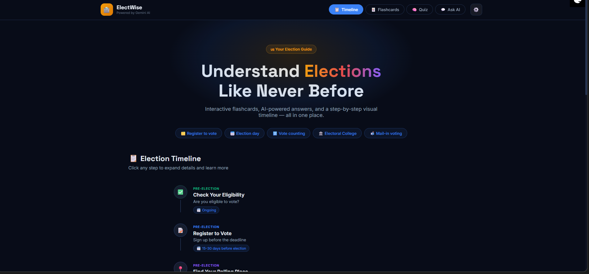

# 🗳️ ElectWise



## 📝 Project Description (Hackathon Submission)
ElectWise is an interactive, AI-powered election guide that empowers first-time voters and citizens with clear, non-partisan information. Built using FastAPI and Google Gemini AI, it transforms complex election procedures into an accessible, step-by-step visual timeline. Users can test their knowledge with an AI-generated quiz, study custom flashcards, or chat directly with the ElectWise AI assistant for personalized answers regarding voter registration, polling day logistics, and election laws. By eliminating confusing jargon, ElectWise makes participating in democracy simple, engaging, and stress-free.

---

## 🎯 Project Details

- **Project Name:** ElectWise
- **Chosen Vertical:** Civic Tech / Education (EdTech)

### 🤔 Approach and Logic
The goal was to create a "one-stop shop" for election information that isn't overwhelming. By breaking down the election process into bite-sized, interactive features (a timeline, flashcards, a quiz, and a chat assistant), the app caters to different learning styles. The logic relies on a clean decoupling of the frontend (HTML/CSS/JS) and backend (FastAPI), with the backend acting as a secure proxy to Google's GenAI API. 

### ⚙️ How the Solution Works
1. **FastAPI Backend:** Serves the frontend static files and exposes RESTful API endpoints (`/api/chat`, `/api/flashcards`, `/api/quiz`, `/api/timeline`).
2. **Google Gemini Integration:** Uses the `google-genai` SDK to dynamically generate tailored JSON payloads for quizzes and flashcards, and powers the conversational AI for the chat interface.
3. **Frontend Application:** A responsive, single-page application (SPA) with a sleek glassmorphic UI. It fetches data from the backend and updates the DOM dynamically without page reloads. The API key can be set directly in the UI's settings drawer or loaded from the backend's `.env` file.

### 📌 Assumptions Made
- Users have basic internet access and a modern web browser to view the interactive UI.
- The Google Gemini API is available and responsive.
- The information requested by the user is non-partisan and focuses on US election processes (as instructed in the AI system prompts).
- Users looking to register or find specific polling data will ultimately be redirected to official sources like `vote.gov` (which the AI is instructed to recommend).

---

## 🚀 How to Run Locally

### Prerequisites
- Python 3.9+
- A Google Gemini API Key (Get one free at [Google AI Studio](https://aistudio.google.com/apikey))

### Steps

1. **Clone the repository:**
   ```bash
   git clone https://github.com/Pratik-sanap/Prompt_wars_week2.git
   cd Prompt_wars_week2
   ```

2. **Install the dependencies:**
   It is recommended to use a virtual environment.
   ```bash
   pip install -r requirements.txt
   ```

3. **Configure your API Key:**
   Create a `.env` file in the root directory and add your Gemini API key:
   ```env
   GEMINI_API_KEY=your_actual_api_key_here
   ```
   *(Alternatively, you can input your API key directly through the settings gear icon in the app UI).*

4. **Start the FastAPI Server:**
   ```bash
   python -m uvicorn main:app --reload --host 0.0.0.0 --port 8000
   ```

5. **Open the App:**
   Navigate to `http://localhost:8000` in your web browser.

---

## 💡 Future Improvements (Post-Prototype)
1. **Localization & Multilingual Support:** Add the ability to automatically translate the UI and AI responses into Spanish, Mandarin, and other languages to support a wider demographic of voters.
2. **State-Specific Dynamic Timelines:** Integrate a civic API (like Google Civic Information API) so the timeline and deadlines automatically adapt based on the user's specific state and zip code.

---

